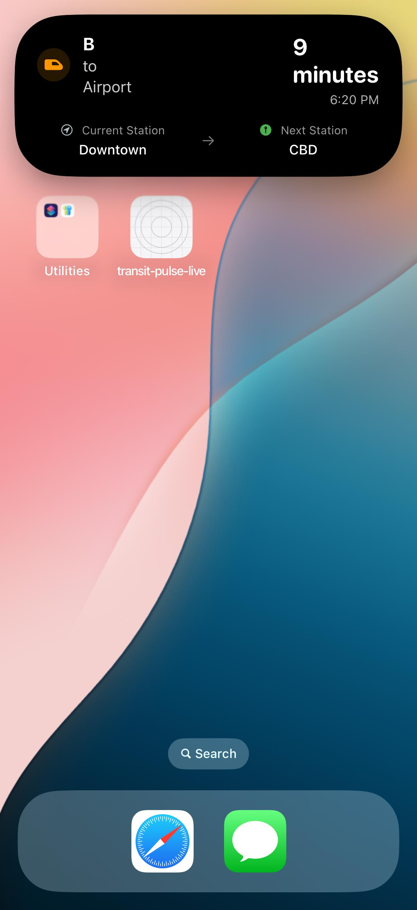

# transit-pulse-tracker

A sample implementation built with Expo GL and iOS Live Activities.

## Overview

Transit Pulse Tracker is a sample implementation of an iOS application that combines 3D visualization powered by Expo GL with iOS Live Activities for real-time transit updates. The app provides a seamless experience for tracking public transportation routes, showing real-time updates on the lock screen and in the Dynamic Island.

## Features

- **3D Visualization**: Interactive 3D map of transit routes using Expo GL
- **Live Activities**: Real-time transit updates on the iOS lock screen
- **Dynamic Island Integration**: Sleek transit information display in Dynamic Island
- **Multi-Vehicle Support**: Supports different transit types (bus, train, subway)
- **Real-time Updates**: Live tracking of transit progress with ETA information
- **Delay Notifications**: Visual indicators for transit delays

## Technologies Used

- React Native with Expo
- Expo GL for 3D visualization
- THREE.js for 3D rendering
- Expo Router for navigation
- Custom Expo Module API for native integration
- ActivityKit for iOS Live Activities
- Swift and SwiftUI for native components

## Screenshots




## Requirements

- iOS 16.2+ for Live Activities support
- Expo SDK 50+
- Xcode 15+
- Node.js 18+

## Setup and Installation

1. Clone the repository:
   ```bash
   git clone https://github.com/Alvinotuya84/dynamic-island-ios-live-activity-expo.git
   cd transit-pulse-tracker
   ```
